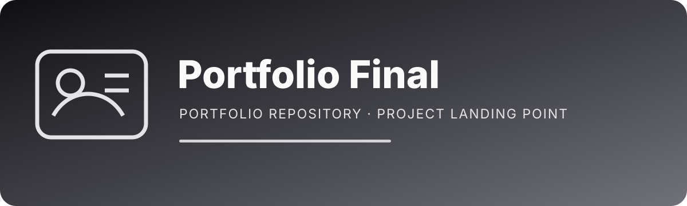

<p align="center"></p>

# Portfolio Final

**A reserved publication repository for the final version of the personal portfolio. It is currently a placeholder, so visitors are told clearly that the deployable application source has not yet been promoted to this branch.**

## Why this repository exists

A final/public portfolio repository can be useful as a clean destination once experimental versions have been tested elsewhere. Keeping this repository reserved allows the finished portfolio to be promoted deliberately instead of mixing production-ready work with design experiments.

Right now, its purpose is to:

- reserve the final portfolio repository name and identity;
- provide a clean future destination for the selected production build;
- avoid pretending that a deployable application exists before source code is actually added;
- define the documentation/security baseline the final project should follow.

## Current state

```text
README.md
assets/readme-hero.svg
```

There is currently no application source on the default branch. This is therefore a **publication target / placeholder**, not a working portfolio deployment.

## What should eventually live here

When the final portfolio version is chosen, this repository should become the visitor-facing source of truth for:

- who the portfolio represents;
- networking, cybersecurity and software focus areas;
- real projects and proof of work;
- contact/collaboration paths;
- the production website source;
- setup and deployment documentation.

## Recommended project structure

```text
app/ or src/       application source
public/            static assets
components/        reusable UI components
docs/              architecture and design notes
.env.example       safe environment-variable template
README.md          purpose, setup, architecture and deployment
```

## Before promoting a build here

Use a short release checklist:

- choose the final portfolio implementation rather than copying multiple experiments;
- remove mock/fake project data;
- verify every external link;
- update screenshots and project descriptions;
- test mobile and desktop layouts;
- verify accessibility and reduced-motion behavior;
- run the production build and lint/tests;
- remove local files, generated caches and secrets;
- update this README so it describes the actual deployed application.

## Security baseline

Do not commit local environment files, API keys, database credentials, private analytics tokens, deployment secrets, certificates or personal account tokens. Anything shipped to browser JavaScript should be considered visible to visitors.

If contact forms, CMS integrations or authenticated admin functionality are added later, keep privileged operations server-side and validate all untrusted input.

## Repository hygiene

Prefer source SVG for custom documentation artwork, compress screenshots before committing them, and keep build directories/dependency caches out of Git.

## Topics and tags

`portfolio` · `developer-portfolio` · `cybersecurity-portfolio` · `network-engineering` · `personal-website` · `portfolio-template` · `web-development` · `work-in-progress`

## Suggested GitHub About description

> Reserved publication repository for the final personal networking/cybersecurity developer portfolio; currently a documented placeholder until the selected production build is promoted.

<p align="center"><sub>Reserved for the final build—without claiming unfinished work is already production-ready.</sub></p>
